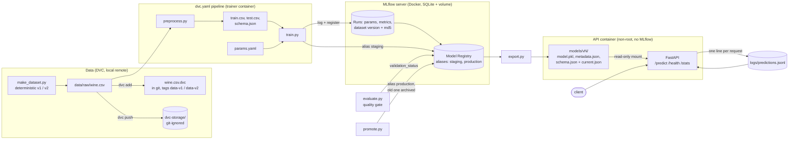

# Architecture

`/stats` is computed from the JSONL log, so monitoring survives container restarts as long as
`./logs` is kept.

## Model card

| | |
|---|---|
| **Model** | scikit-learn `Pipeline`: `StandardScaler` + `RandomForestClassifier` (default) or `LogisticRegression`, chosen in `params.yaml` |
| **Task** | 3-class classification of wine cultivar from 13 chemical measurements |
| **Data** | scikit-learn Wine dataset. `v1` = 178 original rows. `v2` = `v1` + 120 seeded augmented rows (bootstrap resample, 2% multiplicative Gaussian noise) |
| **Split** | Stratified 80/20, seed 42 |
| **Metrics** | Accuracy, macro F1, per-class precision and recall on the held-out split. Quality gate: macro F1 >= 0.90 |
| **Inputs** | 13 numeric features listed in `schema.json` (training min/max are used for out-of-range warnings) |
| **Outputs** | Predicted class (0, 1, 2) and class probabilities |
| **Intended use** | Demonstrating an MLOps lifecycle. Not for any real decision |
| **Limitations** | Tiny, easy, clean dataset: metrics near 1.0 say little about generalisation. `v2` rows are noisy copies of `v1` rows, so its test split leaks training information. No drift detection, no authentication |
| **Lineage** | Each model version links to its MLflow run, which records dataset version, DVC md5, train-set SHA-256, git commit, and Python/library versions |
